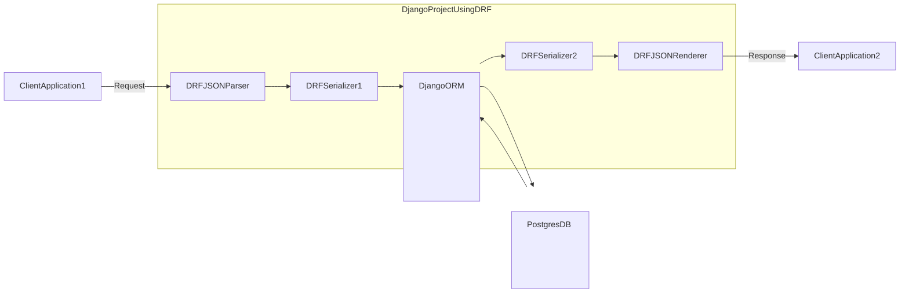

```sh
# 初回のみ ディレクトリ作成、プロジェクト作成
$ cd ch03/myblog
$ uv run django-admin startproject config backend/

# 環境変数を読み込んで Docker立上げ
$ docker compose --env-file ../../.env up --detach
# Docker再ビルド
$ docker compose --env-file ../../.env build

$ docker compose exec web uv run backend/manage.py migrate
# superuser 作成. 設定は docker-compose.yaml で設定した環境変数から読み込む
# WARN は表示されるが登録はできる
$ docker compose exec web uv run backend/manage.py createsuperuser --noinput
```

http://localhost:8000/admin/login/
http://localhost:8000/blog/blog_get_create/
http://localhost:8000/blog/blog_get_update/
http://localhost:8000/blog/blog_get_update_filter/

### JSON Parser - JSON Renderer


```sh
$ mkdir backend/blog
$ docker compose exec web uv run django-admin startapp blog backend/blog
$ mkdir backend/author
$ docker compose exec web uv run django-admin startapp author backend/author
$ mkdir backend/helper
$ docker compose exec web uv run django-admin startapp helper backend/helper
```

### Serializer
```sh
# BlogSerializer クラスの中身を確認できる
$ docker compose exec web uv run backend/manage.py print_serializers
```

### Serializer による レコード登録
- Tag はユニーク制約があり、一度しか登録できない点に注意.
```sh
$ docker compose exec web uv run backend/manage.py dummy_data_register
```

### ModelSerializer を継承したクラスの Metaクラス設定
```sh
from rest_framework import serializers
from rest_framework.validators import UniqueValidator

class HogeSerializer(serializer.ModelSerializer):
    class Meta:
        model = Hoge                            # serialize の対象モデル
        fields = ["fuga", "hoge"]               # 指定したフィールドが対象
        fields = "__all__"                      # すべてのフィールドが対象
        exclude = ["update"]                    # このカラムは対象外
        read_only_fields = ["update"]           # 読み込みのみ
        depth = 1                               # Serializer が取得するリレーションの深さ
        extra_kwargs = {
            "fuga": {"write_only": True},       # True なら書き込みのみ可能
            "hoge": {"min_length": 100},        # 指定されたフィールドの最小長
            "hoge": {"max_length": 100},        # 指定されたフィールドの最大長
            "fugafuga": {"required": True},     # True なら必須フィールド扱い
            "hogehoge": {
                "validators": UniqueValidator(  # カスタムバリデータをフィールドにセットする
                    queryset=Hoge.objects.all()
                )
            }
        }
```

### カスタムフィールド
https://www.django-rest-framework.org/api-guide/fields/#custom-fields

### フィールドを動的に変更する
https://www.django-rest-framework.org/api-guide/serializers/#dynamically-modifying-fields

### Class-based Views
https://www.django-rest-framework.org/tutorial/3-class-based-views/

### GenericAPIView
https://www.django-rest-framework.org/api-guide/generic-views/#concrete-view-classes
```python
from rest_framework import generics

generic.CreateAPIView                   # 作成専用のエンドポイント
generic.ListAPIView                     # 複数のモデルインスタンスを表す読み取り専用エンドポイント
generic.RetrieveAPIView                 # 単一のモデル インスタンスを表す読み取り専用エンドポイントre
generic.DestroyAPIView                  # 単一のモデルインスタンスの削除専用エンドポイント
generic.UpdateAPIView                   # 単一のモデルインスタンスの更新専用エンドポイント
generic.ListCreateAPIView               # 複数のモデルインスタンスを表す読み取り/書き込みエンドポイント
generic.RetrieveUpdateAPIView           # 単一のモデル インスタンスを表す読み取りまたは更新エンドポイント
generic.RetrieveDestroyAPIView          # 単一のモデル インスタンスを表す読み取りまたは削除エンドポイント
generic.RetrieveUpdateDestroyAPIView    # 単一のモデル インスタンスを表す読み取り、書き込み、削除エンドポイント
```

### filter_backends 属性
- 並び替え等ができる

### DjangoFilterBackend
https://www.django-rest-framework.org/api-guide/filtering/#api-guide

### その他コマンド

```sh
$ docker compose exec web uv run backend/manage.py migrate
$ docker compose exec web uv run backend/manage.py makemigrations
# superuser 作成. 設定は docker-compose.yaml で設定した環境変数から読み込む
# WARN は表示されるが登録はできる
$ docker compose exec web uv run backend/manage.py createsuperuser --noinput

# 環境変数の確認
$ docker compose exec web env
$ docker compose --env-file ../../.env exec web env
```

### ruff によるコード整形
```sh
$ docker compose exec web uv run ruff check . --fix
$ docker compose exec web uv run ruff format .
```
