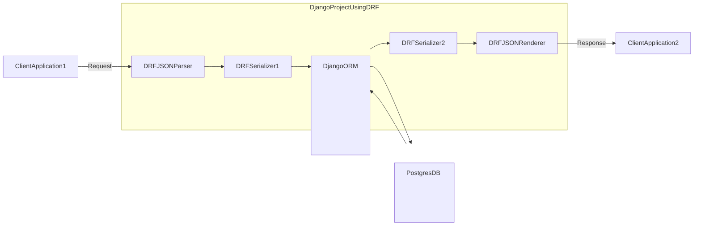

```sh
# 初回のみ ディレクトリ作成、プロジェクト作成
$ cd ch03/myblog
$ uv run django-admin startproject config backend/

# 環境変数を読み込んで Docker立上げ
$ docker compose --env-file ../../.env up --detach
# Docker再ビルド
$ docker compose --env-file ../../.env build

$ docker compose exec web uv run backend/manage.py migrate
# superuser 作成. 設定は docker-compose.yaml で設定した環境変数から読み込む
# WARN は表示されるが登録はできる
$ docker compose exec web uv run backend/manage.py createsuperuser --noinput
```

http://localhost:8000/admin/login/

### JSON Parser - JSON Renderer


```sh
$ mkdir backend/blog
$ docker compose exec web uv run django-admin startapp blog backend/blog
$ mkdir backend/author
$ docker compose exec web uv run django-admin startapp author backend/author
$ mkdir backend/helper
$ docker compose exec web uv run django-admin startapp helper backend/helper
```

### Serializer
```sh
# BlogSerializer クラスの中身を確認できる
$ docker compose exec web uv run backend/manage.py print_serializers
```

### Serializer による レコード登録
```sh
$ docker compose exec web uv run backend/manage.py dummy_data_register
```

### その他コマンド

```sh
$ docker compose exec web uv run backend/manage.py migrate
$ docker compose exec web uv run backend/manage.py makemigrations
# superuser 作成. 設定は docker-compose.yaml で設定した環境変数から読み込む
# WARN は表示されるが登録はできる
$ docker compose exec web uv run backend/manage.py createsuperuser --noinput

# 環境変数の確認
$ docker compose exec web env
$ docker compose --env-file ../../.env exec web env
```

### ruff によるコード整形
```sh
$ docker compose exec web uv run ruff check . --fix
$ docker compose exec web uv run ruff format .
```
