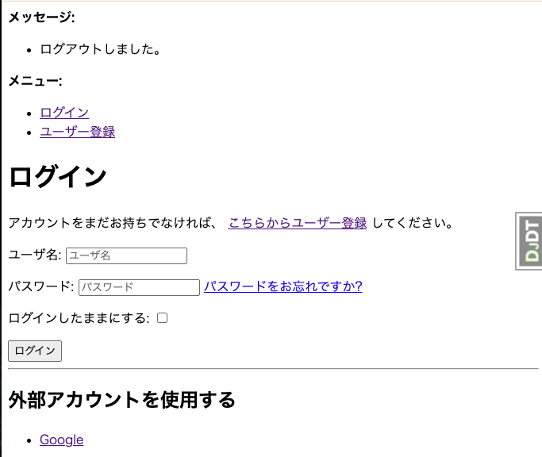

```sh
# 初回のみ ディレクトリ作成、プロジェクト作成
$ cd ch05-ex02-social-login/myblog
$ uv run django-admin startproject config backend/

# 環境変数を読み込んで Docker立上げ
$ docker compose --env-file ../../.env up --detach
# Docker再ビルド
$ docker compose --env-file ../../.env build

$ docker compose --env-file ../../.env exec web uv run backend/manage.py migrate
# superuser 作成. 設定は docker-compose.yaml で設定した環境変数から読み込む
# WARN は表示されるが登録はできる
# カスタムユーザーモデルを利用しており、ユーザーを pnohe_no で識別しているので phone_no を別途設定している
$ docker compose --env-file ../../.env exec web uv run backend/manage.py createsuperuser --noinput
```

- Top ページ
http://127.0.0.1:8000/
- Login ページ
http://127.0.0.1:8000/accounts/login/
- Logout ページ
http://127.0.0.1:8000/accounts/logout/

http://127.0.0.1:8000/admin/login/

### ソーシャルログインの実装

- django-allauth[socialaccount] を イントール
- settings.py の設定を変更
  - INSTALL_APPS に下記を追加.
    - "django.contrib.sites"
    - "allauth.socialaccount"
    - 'allauth.socialaccount.providers.google'
  - SITE_ID = 1 を追加. SITE_ID は次の項目で出てくる、Django Admin の サイトモデルで編集し、Social App モデルで登録するサイト(http://127.0.0.1:8000/) の ID.
  - 下記の設定を追加

```python
SOCIALACCOUNT_PROVIDERS = {
    'google': {
        'SCOPE': [
            'profile',
            'email',
        ],
        'AUTH_PARAMS': {
            'access_type': 'online',
        },
        'OAUTH_PKCE_ENABLED': True,
    }
}
```

- migrate 実行
- Django Admin で、サイトのドメイン名を http://127.0.0.1:8000/ に変更
http://localhost:8000/admin/sites/site/


- Google Cloud の認証情報にアクセス https://console.cloud.google.com/apis/credentials
  - Gmail API を有効にする https://console.cloud.google.com/apis/library/gmail.googleapis.com
  - OAuth2.0 クライアントIDを作成
    - 種類 Webアプリケーション
      - 承認済みの JavaScript 生成元 に http://127.0.0.1:8000 を追加
      - 承認済みの リダイレクトURI に http://127.0.0.1:8000/accounts/google/login/callback/ を追加

- Django Admin の Social App にレコードを追加
  - http://localhost:8000/admin/socialaccount/socialapp/
  - Provider Google
  - 名前: 適当に GoogleLogin とする
  - クライアントID Google Cloud の Client ID を貼り付け
  - シークレットキー Google Cloud の シークレットキー を貼り付け
  - Sites に 先ほど http;//127.0.0.1:8000/ を追加

- urls.py の urlpatterns に、path("accounts/", include("allauth.urls")), を追加.

- ログイン画面に 外部アカウントを使用する、が追加される




```sh
$ mkdir backend/blog
$ docker compose --env-file ../../.env exec web uv run django-admin startapp blog backend/blog
$ mkdir backend/author
$ docker compose --env-file ../../.env exec web uv run django-admin startapp author backend/author
$ mkdir backend/helper
$ docker compose --env-file ../../.env exec web uv run django-admin startapp helper backend/helper
```

### ダミーデータの登録
```sh
$ docker compose --env-file ../../.env exec web uv run backend/manage.py dummy_data_register
```

### Django-All-Auth を使う
https://docs.allauth.org/en/latest/
https://github.com/pennersr/django-allauth

### その他コマンド

```sh
$ docker compose --env-file ../../.env exec web uv run backend/manage.py migrate
$ docker compose --env-file ../../.env exec web uv run backend/manage.py makemigrations
# superuser 作成. 設定は docker-compose.yaml で設定した環境変数から読み込む
# WARN は表示されるが登録はできる
$ docker compose --env-file ../../.env exec web uv run backend/manage.py createsuperuser --noinput

# 環境変数の確認
$ docker compose --env-file ../../.env exec web env
```

### ruff によるコード整形
```sh
$ docker compose --env-file ../../.env exec web uv run ruff check . --fix
$ docker compose --env-file ../../.env exec web uv run ruff format .
```
